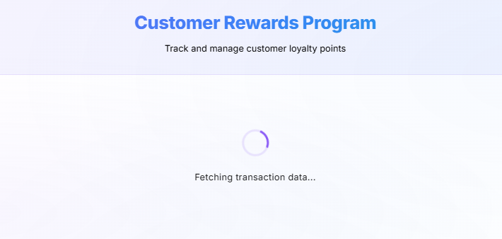
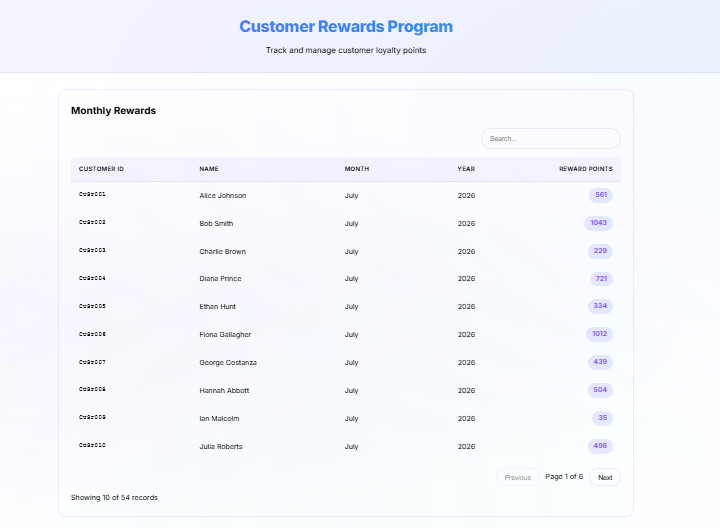
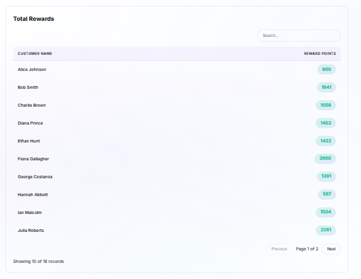
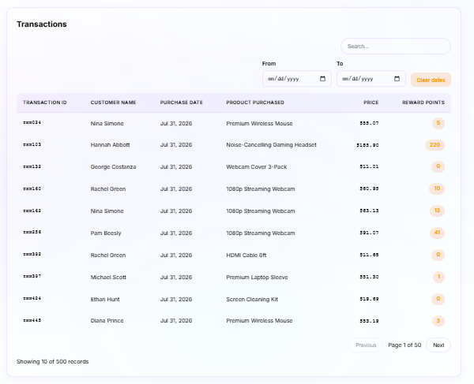

# Customer Rewards Program

A React JS application that calculates and displays reward points for customers based on their purchase transactions over a three-month period.

---

## Overview

This application simulates a retailer's customer rewards program. It fetches transaction data from a simulated async API, calculates reward points using configurable business rules, and displays the results across three interactive tables:

1. **Monthly Rewards** — Reward points per customer per month
2. **Total Rewards** — Cumulative reward points per customer
3. **Transactions** — Individual transaction details with earned points

---

## Business Rules

A customer receives:

- **2 points** for every dollar spent **over $100** in each transaction
- **1 point** for every dollar spent **between $50 and $100** in each transaction
- **0 points** for purchases of $50 or less
- **Fractional dollars are floored** before calculation (e.g., $100.49 → $100 → 50 points)

### Formula

```
For a purchase amount P:
  flooredP = Math.floor(P)
  
  Points = 0
  if flooredP > 100:  Points += (flooredP - 100) * 2
  if flooredP > 50:   Points += min(flooredP - 50, 50) * 1
```

---

## Tech Stack

| Tool | Purpose |
|---|---|
| React 18+ (CRA) | UI framework with functional components & hooks |
| PropTypes | Runtime props validation |
| Jest + React Testing Library | Unit & integration testing |
| ESLint | Code linting and quality |
| loglevel | Structured logging (replaces console.log) |
| CSS Modules | Scoped component styling |

---

## Directory Structure

```
customer-rewards/
├── public/
│   ├── data/
│   │   └── transactions.json             # Mock dataset
│   ├── index.html
├── src/
│   ├── api/
│   │   └── fetchTransactions.js          # Simulated async API call
│   ├── components/
│   │   ├── App/
│   │   │   ├── App.jsx                   # Main app shell
│   │   │   └── App.module.css
│   │   ├── MonthlyRewardsTable/
│   │   │   ├── MonthlyRewardsTable.jsx   # Table 1
│   │   │   └── MonthlyRewardsTable.module.css
│   │   ├── TotalRewardsTable/
│   │   │   ├── TotalRewardsTable.jsx     # Table 2
│   │   │   └── TotalRewardsTable.module.css
│   │   ├── TransactionsTable/
│   │   │   ├── TransactionsTable.jsx     # Table 3
│   │   │   └── TransactionsTable.module.css
│   │   ├── ErrorMessage/
│   │   │   ├── ErrorMessage.jsx
│   │   │   └── ErrorMessage.module.css
│   │   ├── LoadingSpinner/
│   │   │   ├── LoadingSpinner.jsx
│   │   │   └── LoadingSpinner.module.css
│   │   └── SharedTable/
│   │       ├── SharedTable.jsx
│   │       └── SharedTable.module.css
│   ├── constants/
│   │   └── rewardsConfig.js              # Configurable reward tiers
│   ├── hooks/
│   │   └── useFetchTransactions.js       # Custom data fetching hook
│   ├── utils/
│   │   ├── calculateRewardPoints.js      # Pure function: points calc
│   │   ├── aggregateRewards.js           # Pure function: data aggregation
│   │   ├── dateUtils.js                  # Date formatting utilities
│   │   └── logger.js                     # Logger configuration
│   ├── __tests__/                        # All test files
│   ├── index.css                         # Global styles & design tokens
│   ├── index.js                          # Entry point
│   └── setupTests.js
├── .eslintrc.json
├── package.json
└── README.md

```

### Naming Conventions

- **Components**: PascalCase (e.g., `MonthlyRewardsTable.jsx`)
- **Folders**: camelCase for utility folders, PascalCase for component folders
- **Utilities/Hooks**: camelCase (e.g., `calculateRewardPoints.js`)
- **CSS Modules**: `ComponentName.module.css`

---

## Getting Started

### Prerequisites

- Node.js >= 14.x
- npm >= 6.x

### Installation

```bash
# Clone the repository
git clone <repository-url>
cd customer-rewards

# Install dependencies
npm install
```

### Running the Application

```bash
npm start
```

Opens the app at [http://localhost:3000](http://localhost:3000).

---

## Available Scripts

| Script | Command | Description |
|---|---|---|
| `npm start` | `react-scripts start` | Start development server |
| `npm test` | `react-scripts test` | Run tests in watch mode |
| `npm run test:coverage` | `react-scripts test --coverage` | Run tests with coverage report |
| `npm run lint` | `eslint src/` | Lint all source files |
| `npm run build` | `react-scripts build` | Build for production |

---

## Architecture & Approach

### Core Principles

1. **Pure Functions** — All calculation and aggregation logic is implemented as pure functions outside components. No mutations, no side effects.

2. **No Redux** — State management uses React's built-in `useState` and `useEffect` hooks. The custom `useFetchTransactions` hook consolidates loading, error, and data states into a single state object.

3. **Derived State** — Monthly rewards, total rewards, and enriched transactions are computed during rendering using pure functions, NOT stored in state. This prevents stale data issues.

4. **Config-Driven** — Reward tiers are defined in `rewardsConfig.js`. Changing thresholds or point values requires no logic changes.

5. **Functional Programming** — Uses `reduce`, `map`, `sort`, and `filter` exclusively. No `for`/`forEach` loops.

### Key Design Decisions

- **Math.floor()** for decimal handling: $100.49 floors to $100, earning 50 points
- **Sort during rendering**: Sorting happens in utility functions, never stored in state
- **Consolidated state**: Single state object `{ data, loading, error }` instead of three separate useState calls

---

## Data Flow

```
1. App mounts
   └── useFetchTransactions hook fires
       └── fetchTransactions() returns Promise
           └── Simulated API resolves with mock data

2. Data arrives → state updates → App re-renders

3. App computes derived data (NOT stored in state):
   ├── aggregateMonthlyRewards(transactions)  → Table 1 data
   ├── aggregateTotalRewards(transactions)     → Table 2 data
   └── enrichTransactionsWithRewards(transactions) → Table 3 data

4. Tables render with pre-computed, pre-sorted data
```
---

## Screenshots

> **Note**: Run `npm start` and navigate to `http://localhost:3000` to see:
> 1. Loading spinner on initial load

> 2. Monthly Rewards table

> 3. Total Rewards table with cumulative points

> 4. Transactions table with all individual purchases


---


